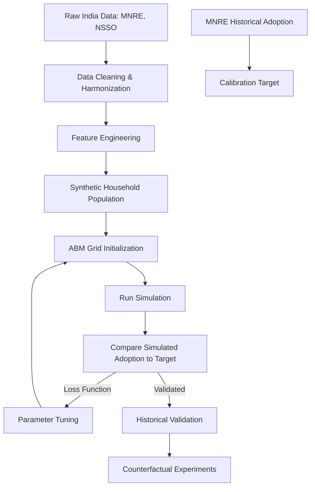

# CALIBRATION PLAN

## 1. Objective
Transform Sangam Vidyut from a structural proof-of-concept into an empirically calibrated simulation of Indian residential solar adoption.

## 2. Calibration Architecture Pipeline

## 3. Separation of Calibration vs Validation Data
To prevent overfitting, the historical MNRE adoption data must be split:
- **Calibration Set:** 2015–2021 adoption data. The model weights (`0.4 / 0.4 / 0.2`) and network density (`ws_k`, `beta`) will be tuned to minimize error against this period.
- **Validation Set:** 2022–2024 adoption data. The tuned model will simulate this period without seeing the answers. If the model accurately predicts the 2022-2024 trajectory (including the spike from PM Surya Ghar policy changes), it is scientifically validated.

## 4. Specific Calibration Targets
### Target A: State-Level Adoption Curves
- **Observed Quantity:** Cumulative residential installations per state per year (MNRE).
- **Model Quantity:** `model.new_adoptions` grouped by spatial cluster.
- **Transformation:** Scale the 500-agent ABM output to the state population, or define 1 agent = X households.
- **Comparison Metric:** Mean Absolute Percentage Error (MAPE). Fits the trajectory shape.

### Target B: Socioeconomic Adoption Disaggregation
- **Observed Quantity:** Qualitative surveys on adoption by income bracket (if available).
- **Model Quantity:** Adopter distribution across `mpce_decile`.
- **Comparison Metric:** Kullback-Leibler (KL) Divergence between observed and modeled distributions.

## 5. Parameter Tuning Space
Once the data is ingested, the structural deadlock identified in Phase 4C must be broken by calibrating the following parameters against the targets:
1. Decision Weights (currently 0.4, 0.4, 0.2)
2. Spontaneous adoption rate (`beta_spontaneous` - to be introduced)
3. Network density (`ws_k`)
4. SIR transmission probability (`beta`)

*Note: The LLM behavior is NOT tuned to match historical data. The LLM operates as an independent zero-shot reasoner evaluating the calibrated synthetic environment.*
